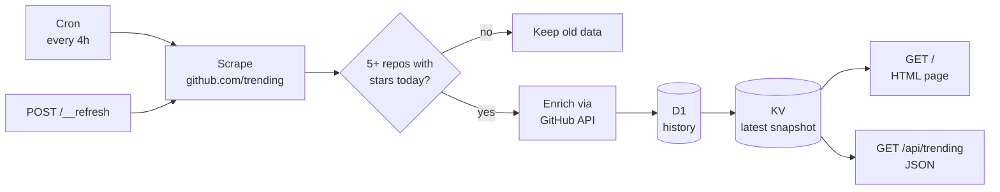

<div align="center">

# trending-repos

A Cloudflare Worker that scrapes [GitHub trending](https://github.com/trending) every 4 hours and tracks how many days each repo has trended.

[](https://trending-repos.danjdewhurst.workers.dev)
[](https://workers.cloudflare.com)
[](https://www.typescriptlang.org)
[](LICENSE)

</div>

---

## What it does

- Scrapes the trending page on a cron trigger every 4 hours.
- Looks up each repo on the GitHub REST API for exact star and fork counts, topics, homepage, and a numeric id that survives renames.
- Stores every scrape in D1, so each repo can carry a **New today** or **N days trending** badge.
- Renders the page from a single KV read, with ETags and caching. The page has no client-side JavaScript and follows your system's light or dark mode.
- Serves the same snapshot as JSON at [`/api/trending`](https://trending-repos.danjdewhurst.workers.dev/api/trending).
- Keeps the previous snapshot if a scrape returns fewer than 5 repos or no stars-today counts, which usually means GitHub changed its HTML.

## How it works



Page loads only touch KV. D1 is written and queried only during a scrape.

| Route | Returns |
|---|---|
| `GET /` | The styled HTML page |
| `GET /api/trending` | The latest snapshot as JSON |
| `POST /__refresh` | Runs a scrape now. Needs `Authorization: Bearer <REFRESH_KEY>` |

## Getting started

You need Node.js and a Cloudflare account.

```bash
git clone https://github.com/forjd/trending-repos.git
cd trending-repos
npm install
```

### Run locally

```bash
npm run db:migrate:local   # create the local D1 schema
npm run dev                # http://localhost:8787
curl localhost:8787/__scheduled   # trigger a scrape
```

Without a `GITHUB_TOKEN`, API lookups are limited to 60 an hour and most repos miss their topics. To set one, and a `REFRESH_KEY` for `/__refresh`, create `.dev.vars`:

```ini
REFRESH_KEY=some-long-random-string
GITHUB_TOKEN=github_pat_...
```

### Deploy your own

1. Create a KV namespace and a D1 database, and put their ids in `wrangler.jsonc`:
   ```bash
   npx wrangler kv namespace create TRENDING
   npx wrangler d1 create trending-repos
   ```
2. Apply the schema: `npm run db:migrate`
3. Set the secrets:
   ```bash
   npx wrangler secret put REFRESH_KEY
   npx wrangler secret put GITHUB_TOKEN   # optional
   ```
4. Deploy: `npm run deploy`

For `GITHUB_TOKEN`, use a fine-grained token with public read-only access and no extra permissions.

## Development

| Command | What it does |
|---|---|
| `npm run dev` | Local server with local KV and D1 |
| `npm test` | Vitest inside the Workers runtime (network is mocked) |
| `npm run typecheck` | `tsc --noEmit` |
| `npm run types` | Regenerate `worker-configuration.d.ts` after editing `wrangler.jsonc` |

## Project layout

```
src/
  index.ts      routes, cron handler, refresh()
  scrape.ts     trending page parser + GitHub API enrichment
  history.ts    D1 writes and badge stats
  render.ts     the page: HTML and CSS in one template
  types.ts      Repo and Snapshot
test/           Vitest tests and a fixture copy of the trending page
migrations/     D1 schema
```

## License

[MIT](LICENSE) © Forjd

<div align="center">
<sub>Not affiliated with GitHub. Data comes from the public trending page and REST API.</sub>
</div>
